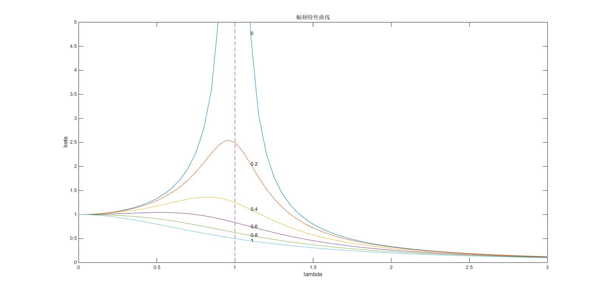
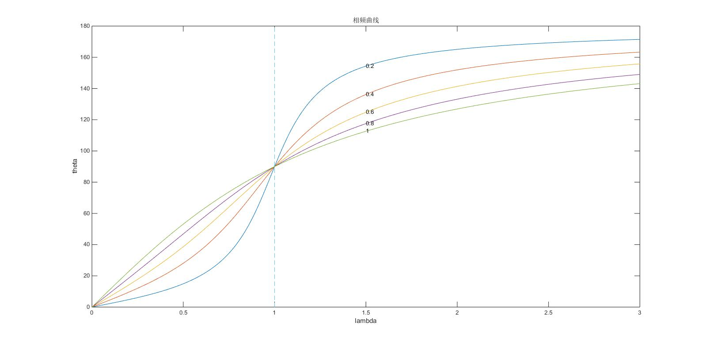

#振动力学程序作业-20161030
1. 绘制幅频特性曲线
1.  “半功率法”计算ζ
1.  绘制相频曲线

##Student Info
* 姓名：徐远方
* 学号：2012301890058

##1.绘制幅频特性曲线
###Code-MATLAB(Plot4BetaLambda.m)
    %@author: xuyuanfang
    clear
    clc
    
    for zeta = 0:0.2:1
        lambda = 0:0.05:3;
        beta = 1./sqrt((1 - lambda.^2).^2 + (2*zeta*lambda).^2);
        plot(lambda, beta)
        text(1.1, 1/sqrt((1 - 1.1^2)^2 + (2*zeta*1.1)^2), num2str(zeta));
        hold on;
    end
    
    plot([1,1], [0,5], '--')
    axis([0 3 0 5])
    title('幅频特性曲线')
    xlabel('lambda')

###Figure

##2.“半功率法”计算ζ
###Code-MATLAB(Cal4Zeta.m)
    %@author: xuyuanfang
    clear 
    clc
    
    zeta = 0.1;
    Q = 1/2/zeta;
    
    syms Q_divsqrt2
    lambda = solve('(1 - lambda^2)^2 + (2*0.1*lambda)^2 = 1/Q_divsqrt2^2', 'lambda');
    
    Q_divsqrt2 = Q/sqrt(2);
    lambda = eval(lambda);
    lambda = abs(lambda);
    lambda = unique(lambda);
    zeta_cal = 1/2*abs(lambda(1) - lambda(2))

###Output
    zeta_cal =
    
             0.102062959194149
             
###Compare
相对误差 = 2% ，在误差允许的范围内

##3.绘制相频曲线
###Code-MATLAB(Plot4ThetaLambda.m)
    %@author: xuyuanfang
    clear
    clc
    
    for zeta = 0.2:0.2:1
        lambda = 0:0.01:3;
        theta = atan(2*zeta*lambda./(1 - lambda.^2)).*180./pi;
        for i = 1:length(theta)
            if theta(i) < 0
                theta(i) = theta(i) + 180;
            end
        end
        plot(lambda, theta)
        text(1.5, 180 + atan(2*zeta*1.5/(1 - 1.5^2)).*180./pi, num2str(zeta));
        hold on
    end
    
    plot([1,1], [0,180], '--')
    title('相频曲线')
    xlabel('lambda')
    ylabel('theta')

###Figure

