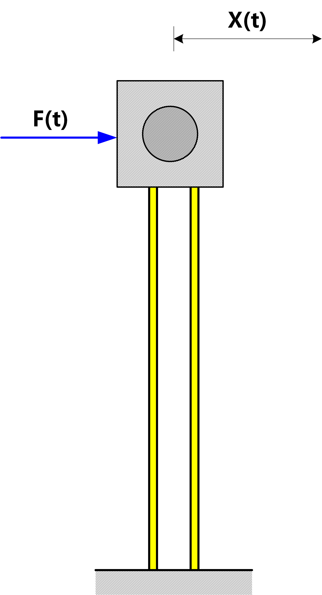
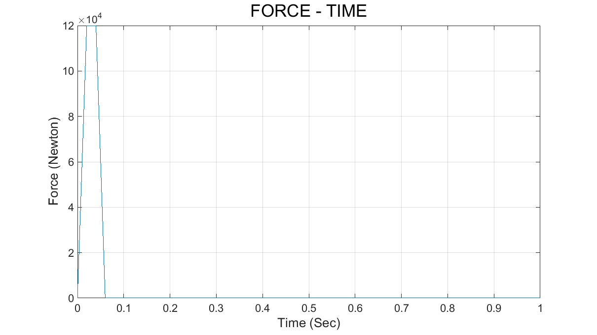
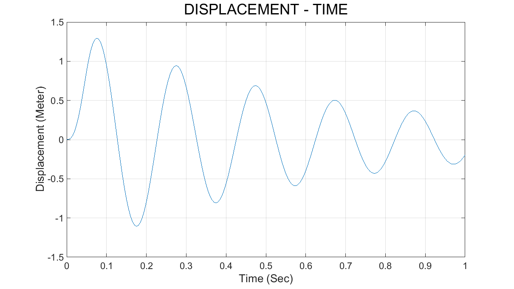
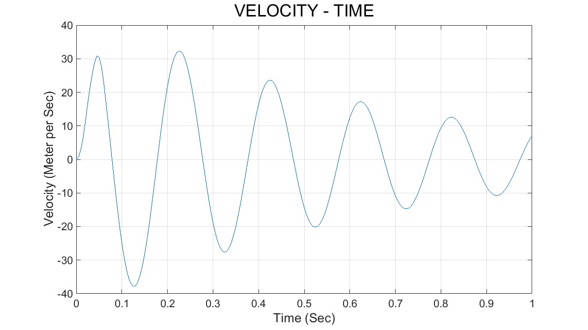
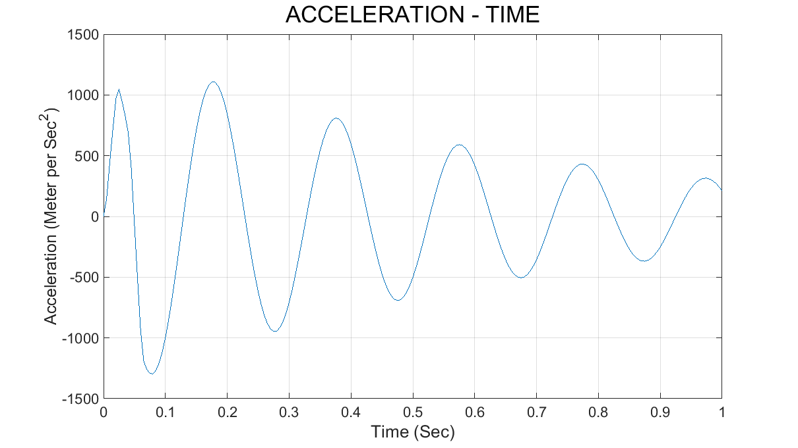
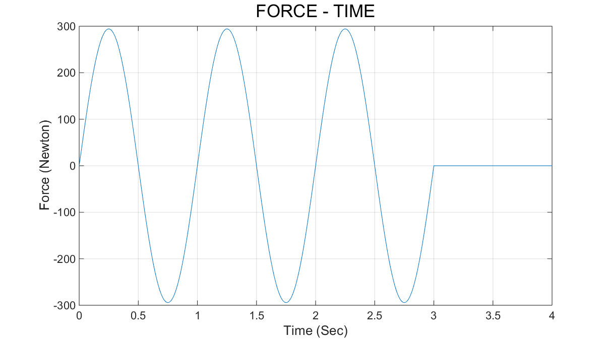
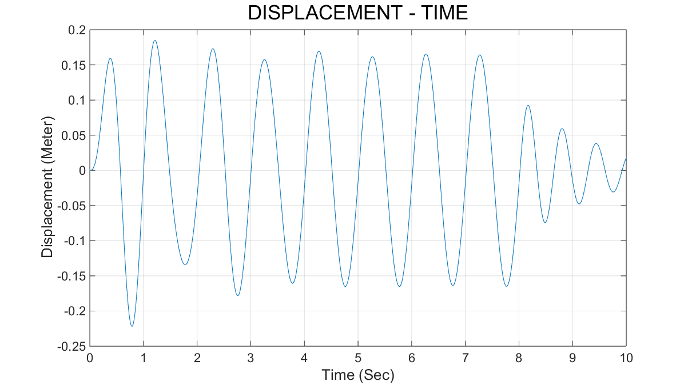
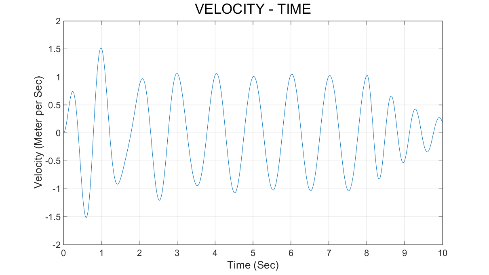
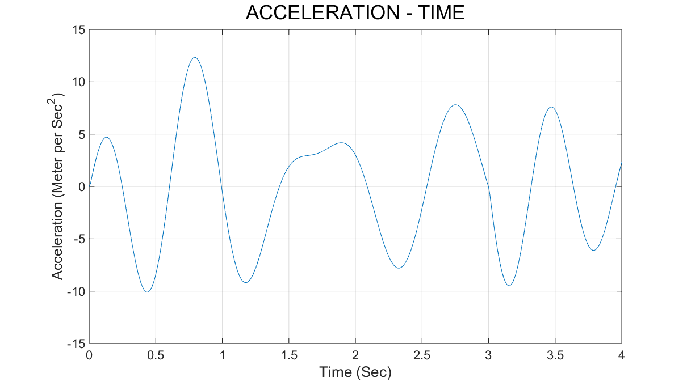

# 振动力学程序作业-20161119
# 
**0. 计算模型**

**1. 使用杜哈梅积分计算任意非周期激励的响应**

**1.1 水塔受脉冲激励的算例**

**1.2 水塔受正弦激励的算例**

**2. 结论**

**附.Code-MATLAB**

## Student Info
- 姓名：徐远方
- 学号：

## 0. 计算模型
### 水塔受非周期水平激励力，由激励力函数F.m给定。
 

## 1. 使用杜哈梅积分计算任意非周期激励的响应
## 1.1 水塔受脉冲激励的算例
### 参数
------
| k (N/m) | m (kg) | c (N*s/m) | t (s) | delta_t (s) | x0 (m) | v0 (m/s)
| :------- | :-------| :-------| :-------| :------- | :-------| :-------|
| 1e5 | 100 | 316.2 | 1 | 0.005 | 0 | 0 |
------

### Figure

## 1.2 水塔受正弦激励的算例
### 参数
------
| k (N/m) | m (kg) | c (N*s/m) | t (s) | delta_t (s) | x0 (m) | v0 (m/s)
| :------- | :-------| :-------| :-------| :------- | :-------| :-------|
| 2953.5 | 30 | 41.67 | 4 | 0.01 | 0 | 0 |

### Figure

## 2.结论

以上两个算例的各个参数均参考pdf文件（duhamel-newcivil.pdf）的参数给出，计算结果绘出的图像与pdf文件中的吻合。由于本程序中速度、加速度项是通过差分法计算的，所以在时间步长较小时，它们的数值误差可能会比较大。

###### 备注
###### 在pdf文件（duhamel-newcivil.pdf）的Example 2算例中，重力加速度应为9.81(m/s^2)，而原文写成了981(m/s^2)，致使其计算结果大了100倍。另外由于速度、加速度项的计算方法选取的不同，除去原文作者错误结果的100倍的影响后，本程序计算结果与其还是存在较小的差异，但是误差在可以接受的范围内。

------
## 附: Code-MATLAB
### Main Program (Acyclic.m)
    % @author: xuyuanfang
    clear 
    clc
    tic

    c = 316.2;  % 算例1.1 316.2 算例1.2 41.67
    k = 1e5;    % 算例1.1 1e5 算例1.2 2953.5
    m = 100;    % 算例1.1 100 算例1.2 30
    t = 1;      % 算例1.1 1 算例1.2 4
    delta_t = 0.005;    % 算例1.1 0.005 算例1.2 0.01
    div_num = t/delta_t;
    x0 = 0;
    v0 = 0;
    
    t_matrix = 0:delta_t:t;
    F_matrix = zeros(div_num + 1,1);
    x_matrix = zeros(div_num + 1,1);
    v_matrix = zeros(div_num + 1,1);
    a_matrix = zeros(div_num + 1,1);
    precision = 1;
    
    omega0 = sqrt(k/m)
    zeta = c/2/m/omega0
    omegad = omega0*sqrt(1 - zeta^2)
    
    for i = 1:div_num + 1
        tau = i*t/div_num;
        x = 0;
        init = exp(-zeta*omega0*tau)*(x0*cos(omegad*tau) + ...
            (v0 + zeta*omega0*x0)/omegad*sin(omegad*tau));
        for j = 1:i
            tau0 = (j - 1)*t/div_num;
            tau1 = j*t/div_num;
            % Duhamel(a, b, t, c, k, m, precision)
            D = F(tau0)*Duhamel(tau0, tau1, tau, c, k, m, precision);
            x = x + D;
        end
        x_matrix(i) = init + x;
        F_matrix(i) = F(tau0);
    end
    
    v_matrix(1) = 0;
    for i = 1:div_num
        v_matrix(i + 1) = (x_matrix(i + 1) - x_matrix(i))/delta_t;
    end
    
    a_matrix(1) = F(1)/m;
    for i = 1:div_num
        a_matrix(i + 1) = (v_matrix(i + 1) - v_matrix(i))/delta_t;
    end
    
    subplot(2,2,1)
    plot(t_matrix, x_matrix);
    grid on
    title('DISPLACEMENT - TIME', 'FontSize', 16)
    xlabel('Time (Sec)', 'FontSize', 12)
    ylabel('Displacement (Meter)', 'FontSize', 12)
    
    subplot(2,2,2)
    plot(t_matrix, v_matrix);
    grid on
    title('VELOCITY - TIME', 'FontSize', 16)
    xlabel('Time (Sec)', 'FontSize', 12)
    ylabel('Velocity (Meter per Sec)', 'FontSize', 12)
    
    subplot(2,2,3)
    plot(t_matrix, a_matrix);
    grid on
    title('ACCELERATION - TIME', 'FontSize', 16)
    xlabel('Time (Sec)', 'FontSize', 12)
    ylabel('Acceleration (Meter per Sec^2)', 'FontSize', 12)
    
    subplot(2,2,4)
    plot(t_matrix, F_matrix);
    grid on
    title('FORCE - TIME', 'FontSize', 16)
    xlabel('Time (Sec)', 'FontSize', 12)
    ylabel('Force (Newton)', 'FontSize', 12)
    toc

### Subprogram (Duhamel.m)
    % @author: xuyuanfang
    function D = Duhamel(a, b, t, c, k, m, precision)
        %Simpson
        if a == b
            D = 0;
        else
            omega0 = sqrt(k/m);
            zeta = c/2/m/omega0;
            omegad = omega0*sqrt(1 - zeta^2);
    
            h = @(tau, t)1./m./omegad.*exp(-zeta.*omega0.*(t - tau))...
                .*sin(omegad.*(t- tau));
    
            c = (b - a)/2/precision;
            A = a:c:b;       %A为(a,b)的n等分横坐标向量
            B = h(A, t);     %B为A对应的函数值向量
            D = 0;
            for i = 1:precision; 
                s = c/3*(B(2*i - 1) + 4*B(2*i) + B(2*i + 1));
                D = D + s;
            end
        end
    end

### Subprogram (F.m)
    % @author: xuyuanfang
    function F = F(t)
        % 脉冲激励时的激励函数
        if t <= 0.02
            F = 6e6*t;
        elseif t > 0.02 && t <= 0.04
            F = 1.2e5;
        elseif t >0.04 && t <= 0.06
            F = 3.6e5 - 6e6*t;
        else
            F = 0;
        end
    end

    % 下为正弦激励时的激励函数
    % if t <= 3
    % F = 30*9.81*sin(2*pi*t);
    % else
    % F = 0;
    % end

----
###### 本文由Markdown编排，图片使用的png格式，图片清晰度不及LaTex使用的pdf图片格式，故将此次作业的电子版二维码置于下方。

 

#### 电子版地址 https://github.com/xuyuanfang/mechanics_of_vibration