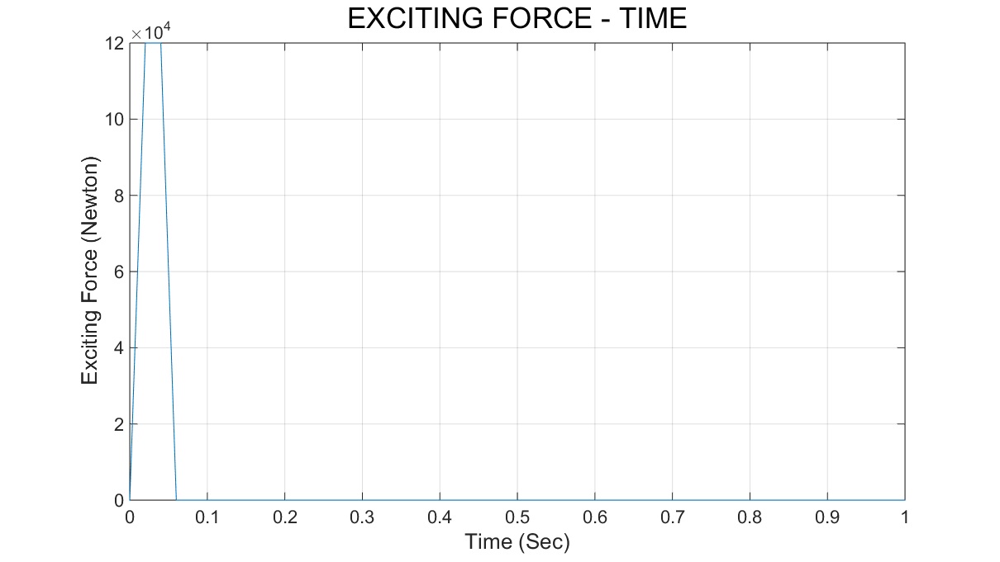
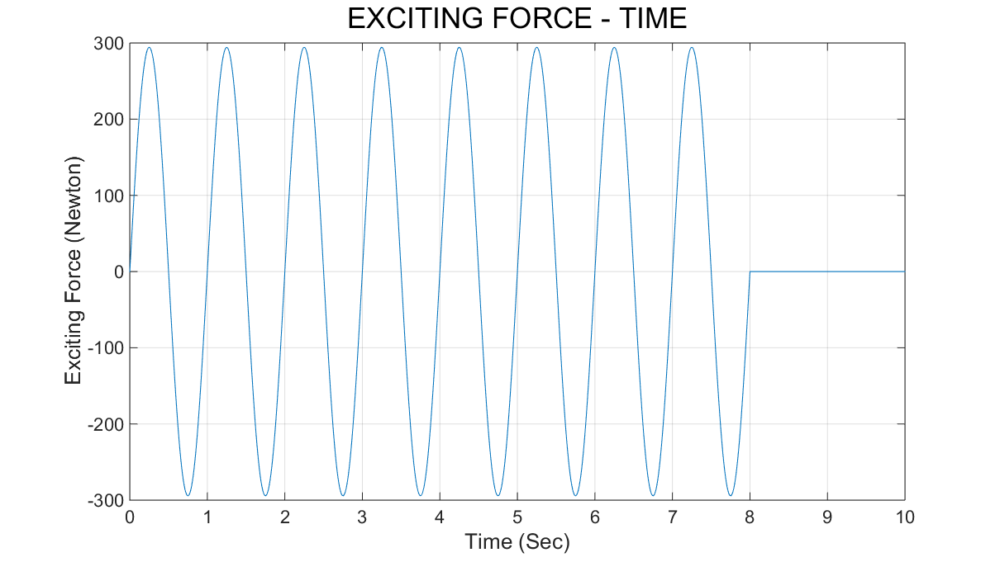

# 振动力学程序作业-20161119

**0. 计算模型**

**1. 使用杜哈梅积分计算任意非周期激励的响应**

**1.1 水塔受脉冲激励的算例**

**1.2 水塔受正弦激励的算例**

**2. 结论**

**附.Code-MATLAB**

## Student Info

- 姓名：徐远方
- 学号：

## 0. 计算模型

### 水塔受非周期水平激励力，由激励力函数F.m给定。

- 当程序的同级目录下存在激励力记录表格文件（input.xlsx）时，激励力函数F.m将直接读取表格文件的数据到激励力矩阵中
- 当程序的同级目录下不存在激励力记录表格文件（input.xlsx）时，激励力函数F.m将根据算例所给的激励力变化函数，结合修正后的时间步长生成相应的激励力矩阵，同时生成对应的激励力表格文件（input.xlsx）

 

## 1. 使用杜哈梅积分计算任意非周期激励的响应

## 1.1 水塔受脉冲激励的算例

### 参数

------
| k (N/m) | m (kg) | c (N*s/m) | t (s) | delta_t (s) | x0 (m) | v0 (m/s) |
| :------- | :-------| :-------| :-------| :------- | :-------| :-------|
| 1e5 | 100 | 316.2 | 1 | 0.005 | 0 | 0 |
------

### 激励力
------
| t (s) | 0 ≤ t < 0.02 | 0.02 ≤ t < 0.04 | 0.04 ≤ t < 0.06 | 0.06 ≤ t ≤ 1 |
| :------- | :-------| :-------| :-------| :------- |
| F (N) | 6000000 t | 120000 | 360000 - 6000000 t | 0 |
------

### Figure

## 1.2 水塔受正弦激励的算例

### 参数

------
| k (N/m) | m (kg) | c (N*s/m) | t (s) | delta_t (s) | x0 (m) | v0 (m/s) |
| :------- | :-------| :-------| :-------| :------- | :-------| :-------|
| 2953.5 | 30 | 41.67 | 10 | 0.01 | 0 | 0 |

### 激励力
------
| t (s) | 0 ≤ t < 8 | 8 ≤ t ≤ 10 |
| :------- | :-------| :-------|
| F (N) | 294.3 sin(2pi*t) | 0 |
------

### Figure

## 2. 结论

以上两个算例的各个参数均参考pdf文件（duhamel-newcivil.pdf）的参数给出，唯一的区别是本文的两个算例计算的响应时间比原文更长。在相同时间区间内，计算结果绘出的图像与pdf文件中的相吻合。由于本程序中速度、加速度项是通过差分法计算的，所以当时间步长较小时，它们的数值误差可能会比较大。

对于算例1.1，在零初始条件下，外部施加一个持续时间较短的脉冲激励，水塔相应地产生受迫振动（当然，同时也有自由振动相伴发生，但是因为自由振动的响应本来就不大，又脉冲激励时间较短，所以它对整个系统的振动影响较小，在各项响应指标的图中都没有明显的体现）。0.06秒之后水塔在无激励的条件下自由振动，在阻尼的持续作用下，直至停止响应。

对于算例1.2，在零初始条件下，外部施加持续8秒的正弦激励，水塔因此产生受迫振动和自由振动，观察图中的曲线，不难发现，在前3秒的时间内，水塔的各项响应指标都是不太稳定的，这一现象是因为在发生受迫振动的同时受到了自由振动的影响而产生的。在3秒之后8秒之前的时间内，水塔的各项响应指标是趋于稳定的，同时也是和正弦激励相互对应的，这是因为在阻尼的持续作用下，相伴发生的自由振动逐渐衰减，进而消失，最终整个系统为稳态响应，也就是只存在受迫振动。8秒之后水塔在无激励的条件下自由振动，在阻尼的持续作用下，直至停止响应。

###### 备注

###### 在pdf文件（duhamel-newcivil.pdf）的Example 2算例中，原文重力加速度记为981(cm/s^2)，而在本文中记为9.81(m/s^2)，致使原文的计算结果的数值为本文的100倍。另外由于速度、加速度项选取的计算方法不同，除去原文作者结果的100倍的影响后，本程序计算结果与原文存在极小的差异，但是误差在可以接受的范围内，所以可以认为计算结果是相吻合的。

------
## 附: Code-MATLAB

### Main Program (Cal4Non_periodic_excitation.m)

    % @author: xuyuanfang
    clear 
    clc
    tic
    
    c = 316.2;  % 算例1.1 316.2 算例1.2 41.67
    k = 1e5;    % 算例1.1 1e5 算例1.2 2953.5
    m = 100;    % 算例1.1 100 算例1.2 30
    total_t = 1;      % 算例1.1 1 算例1.2 10
    delta_t = 0.005;    % 算例1.1 0.005 算例1.2 0.01
    total_exciting_t = 0.06;    % 算例1.1 0.06 算例1.2 8
    x0 = 0;
    v0 = 0;
    
    [Data_matrix, new_delta_t] = F(delta_t, total_exciting_t);
    
    div_num = ceil(total_t/new_delta_t);
    new_total_t = div_num*new_delta_t;
    
    if size(Data_matrix, 1) < div_num
    	line = size(Data_matrix, 1);
    	for i = line + 1:div_num + 1
            Data_matrix(i, 2) = 0;
    	end
    end
    
    t_matrix = 0:new_delta_t:new_total_t;
    F_matrix = Data_matrix(:, 2);
    x_matrix = zeros(div_num + 1, 1);
    v_matrix = zeros(div_num + 1, 1);
    a_matrix = zeros(div_num + 1, 1);
    precision = 1;
    
    omega0 = sqrt(k/m)
    zeta = c/2/m/omega0
    omegad = omega0*sqrt(1 - zeta^2)
    
    for i = 1:div_num + 1
        tau = i*new_total_t/div_num;
        x = x0;
        init = exp(-zeta*omega0*tau)*(x0*cos(omegad*tau) + ...
            (v0 + zeta*omega0*x0)/omegad*sin(omegad*tau));
        for j = 1:i
            tau0 = (j - 1)*new_total_t/div_num;
            tau1 = j*new_total_t/div_num;
            % Duhamel(a, b, t, c, k, m, precision)
            D = F_matrix(j)*Duhamel(tau0, tau1, tau, c, k, m, precision);
            x = x + D;
        end
        x_matrix(i) = init + x;
    end
    
    v_matrix(1) = v0;
    for i = 1:div_num
        v_matrix(i + 1) = (x_matrix(i + 1) - x_matrix(i))/new_delta_t;
    end
    
    a_matrix(1) = F_matrix(1)/m;
    for i = 1:div_num
        a_matrix(i + 1) = (v_matrix(i + 1) - v_matrix(i))/new_delta_t;
    end
    
    subplot(2, 2, 1)
    plot(t_matrix, F_matrix);
    grid on
    title('EXCITING FORCE - TIME', 'FontSize', 16)
    xlabel('Time (Sec)', 'FontSize', 12)
    ylabel('Exciting Force (Newton)', 'FontSize', 12)
    
    subplot(2, 2, 2)
    plot(t_matrix, x_matrix);
    grid on
    title('DISPLACEMENT - TIME', 'FontSize', 16)
    xlabel('Time (Sec)', 'FontSize', 12)
    ylabel('Displacement (Meter)', 'FontSize', 12)
    
    subplot(2, 2, 3)
    plot(t_matrix, v_matrix);
    grid on
    title('VELOCITY - TIME', 'FontSize', 16)
    xlabel('Time (Sec)', 'FontSize', 12)
    ylabel('Velocity (Meter per Sec)', 'FontSize', 12)
    
    subplot(2, 2, 4)
    plot(t_matrix, a_matrix);
    grid on
    title('ACCELERATION - TIME', 'FontSize', 16)
    xlabel('Time (Sec)', 'FontSize', 12)
    ylabel('Acceleration (Meter per Sec^2)', 'FontSize', 12)
    
    toc

### Subprogram1 (Duhamel.m)

    % @author: xuyuanfang
    function D = Duhamel(a, b, t, c, k, m, precision)
        % Simpson
        if a == b
            D = 0;
        else
            omega0 = sqrt(k/m);
            zeta = c/2/m/omega0;
            omegad = omega0*sqrt(1 - zeta^2);
    
            h = @(tau, t)1./m./omegad.*exp(-zeta.*omega0.*(t - tau))...
                .*sin(omegad.*(t - tau));
    
            p = (b - a)/2/precision;
            A = a:p:b;       % A为(a,b)的n等分横坐标向量
            B = h(A, t);     % B为A对应的函数值向量
            D = 0;
            for i = 1:precision; 
                s = p/3*(B(2*i - 1) + 4*B(2*i) + B(2*i + 1));
                D = D + s;
            end
        end
    end

### Subprogram2 (F.m)

    % @author: xuyuanfang
    function [Data_matrix, new_delta_t] = F(delta_t, total_exciting_t)
        if exist('input.xlsx', 'file') == 0
            div_num = ceil(total_exciting_t/delta_t);
            new_delta_t = total_exciting_t/div_num;
            data = zeros(div_num + 1, 2);
            for i = 0:div_num
                data(i + 1, 1) = i*new_delta_t;% exciting_t
                % 算例1.1 脉冲激励时的激励函数start
                if i*new_delta_t <= 0.02
                    data(i + 1, 2) = 6e6*i*new_delta_t;
                elseif i*new_delta_t <= 0.04
                    data(i + 1, 2) = 1.2e5;
                else
                    data(i + 1, 2) = 3.6e5 - 6e6*i*new_delta_t;
                end
                % 算例1.1 脉冲激励时的激励函数end
            end
            filename = 'input.xlsx';
            sheet = 1;
            xlRange = 'A1';
            xlswrite(filename, data, sheet, xlRange)
            Data_matrix = data;
        else
            Data_matrix = xlsread('input.xlsx');
            new_delta_t = Data_matrix(2, 1) - Data_matrix(1, 1);
        end
    end

    %     % 算例1.2 正弦激励时的激励函数start
    %     data(i + 1, 2) = 30*9.81*sin(2*pi*i*new_delta_t);
    %     % 算例1.2 正弦激励时的激励函数end

----

###### 本文由Markdown编排，图片使用的png格式，图片清晰度不及LaTex使用的pdf图片格式，故将此次作业的电子版二维码置于下方，以便查阅。

 

#### Github地址 https://github.com/xuyuanfang/mechanics_of_vibration